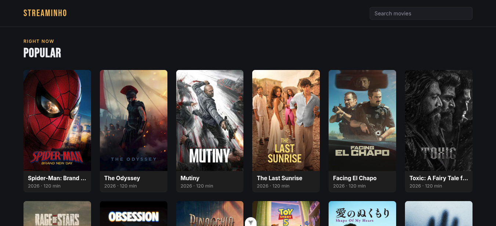
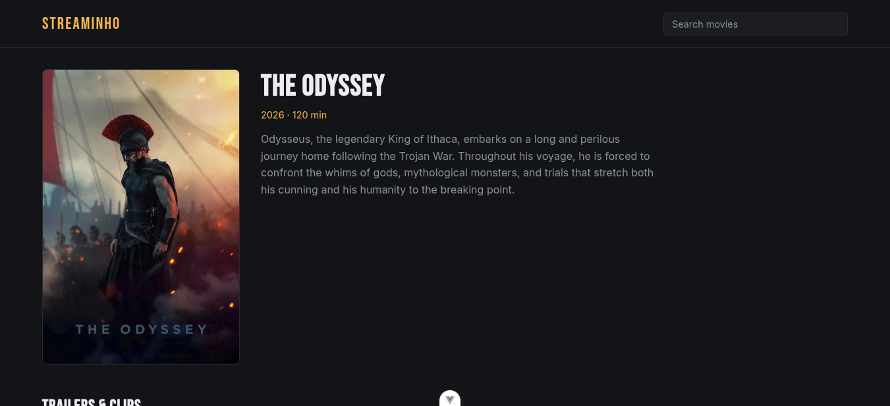
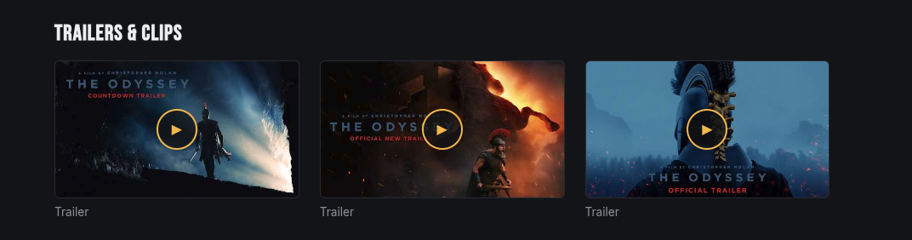

# 🎬 Streaminho

A streaming-style movie catalog built to explore and display information about popular and now-showing movies using the **TMDB API**. Lets you browse titles, view details, watch trailers/clips, and search.

> 🚧 **Work in progress** — production deployment is planned for the near future.

---

## 📸 Preview

**Home — Popular movies**

Grid of popular movies with poster, title, year, and duration, plus a search bar in the header.



**Movie detail page**

Detail view with poster, title, year, duration, synopsis, and a section with playable trailers/clips.




---

## ✨ Features

- 🎞️ Popular / now-showing movies listing
- 🔍 Movie search
- 📄 Detail page with synopsis, year, duration
- ▶️ Trailers and clips per movie
- 🔐 JWT authentication
- 📚 API documentation with Swagger

---

## 🏗️ Architecture

The project is split into two parts, each in its own folder, and containerized with Docker:

```
streaminho/
├── backend/     # REST API - Spring Boot
├── frontend/    # SPA - Vue 3
└── docker-compose.yml
```

---

## 🛠️ Tech Stack

### Backend
- **Spring Boot** — REST API
- **PostgreSQL** — database
- **TMDB API** (via `RestClient`) — movie data source
- **Spring Security + JWT** — authentication
- **Swagger / OpenAPI** — endpoint documentation

### Frontend
- **Vue 3**
- **TypeScript**
- **Pinia** — state management

### Infrastructure
- **Docker** / docker-compose

---

## 📖 API Documentation

With the backend running, interactive Swagger docs are available at:

```
http://localhost:<port>/swagger-ui.html
```

---

## 🗺️ Roadmap

- [ ] Production deployment
- [ ] TV series support
- [ ] "Where to watch" info per title (streaming platforms / availability)
- [ ] User favorites / watchlists

---